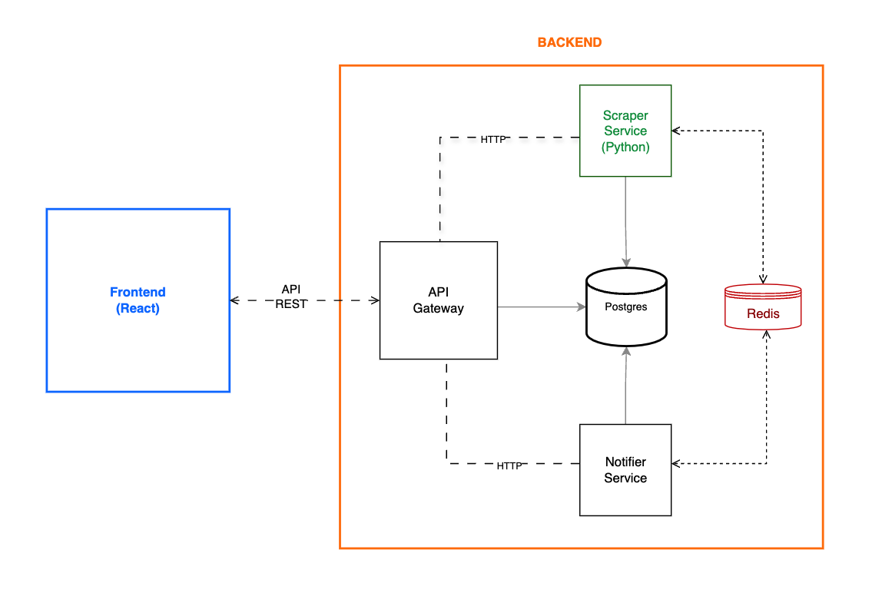

# Ejercicio Técnico — Ingesta y Procesamiento de Normativas SGCAN

## 0. Resolución de la Prueba

### Consigna 1

Se crearon los archivos de modelo para la base de datos:
  Models/CsvFile.cs
  Models/Documento.cs
Se creó el DTO para adaptar las columnas del CSV al modelo de la base de datos
  DTO/DocumentoCsvMap.cs
Se creó el archivo de contexto de migración
  Data/AppDbContext.cs
Se creó el controlador que gestiona la subida de archivos CSV
  Controllers/ArchivoController.cs

### Consigna 2

Se creó el archivo de conexión a la BD 
  db.py
Se creó el archivo de modelos
  models.py
Se creó el extractor de texto
  extractor_texto.py
Se creó el archivo de tarea para procesar los enlaces
  jobs/csv_processor.py
Se crearon las rutas del servicio en
  main.py
Se crearon archivos de pruebas de conexión y extracción de texto 
  test_db.py
  test_extractor_texto.py
Se optó por un servicio adicional que de forma automática cada x minutos actualice los CSV sin intervención del usuario con estado QUEUED
  jobs/worker.py

### Consigna 3

De forma opcional se creo la carpeta notifications en el scraper. Dentro se crearon los archivos
  notificacion.py
  test_notificacion.py

### Consigna 4

Se utilizó parte de la plantilla otorgada para la prueba. 
Se crearon los directorios de trabajo
  app/prueba
  components/prueba
Se creo un .env con variables de entorno
Se creo un acceso a MailHog para verificar el envio de notificaciones
Url de acceso 127.0.0.1:9999

## A. Descripción de la Prueba

En la Secretaría General de la Comunidad Andina (SGCAN), cada mes/año se cargan múltiples **normativas oficiales** (decisiones, resoluciones, reglamentos).  
La carga se realiza mediante un **archivo CSV** (lote de documentos) que detalla la información de cada documento, junto con los links de los archivos originales en formatos como **.doc** y **.pdf**.

### Archivos CSV

Los archivos de ejemplo se encuentran en `./csv_files/`

[csv_files/listado_1969.csv](./csv_files/listado_1969.csv)

[csv_files/listado_1970.csv](./csv_files/listado_1970.csv)

[Carpeta con todos los CSVs de ejemplo](./csv_files)

## B. Requerimientos

### 1. Ingesta de CSV (Servicio .NET)

- Leer el archivo CSV.
- Guardar en base de datos los registros con los siguientes campos:
  - `nomenclatura`
  - `titulo`
  - `fecha_publicacion`
  - `documento` (ej. `DEC006.doc`)
  - `url_documento`
  - `paginas`
  - `tipo_documento`
- Estado inicial del documento: **`QUEUED`**.

---

### 2. Extracción de texto (Servicio Python)

- Un servicio independiente en Python debe:
  - Leer cada registro en estado **`QUEUED`**.
  - Leer el documento desde `url_documento` (se puede procesar en memoria, no es necesario descargar el documento).
  - Extraer el texto del documento (se pueden utilizar librerias como: `python-docx`, `pdfminer`, etc.).
  - Guardar el texto en la base de datos.
  - Actualizar el estado del documento a **`PROCESSED`**.
  - Manejar errores: si falla la extracción → **`ERROR`** (puede que algunos documentos sean PDFs con imagenes).

**Restricciones:**

- Procesamiento: El sistema debe permitir que la extracción de texto desde los links en segundo plano, evitando bloquear la interfaz de usuario o la interacción principal con el sistema.

- Idempotencia **(OPCIONAL)**:
  - Antes de procesar un archivo, el sistema calculará un hash único (SHA-256 o similar) en base al contenido del archivo.
  - Si el hash ya existe en el sistema, se evitará un reprocesamiento innecesario.
  - En su lugar, se reutilizará el resultado previamente almacenado.

---

### 3. Notificaciones **masivas**

- Una vez finalizada la **extracción de todo el lote**:
  - Llamar a un **servicio externo de notificaciones**.
  - Notificar a todos los usuarios del sistema (**100 o más usuarios**).
  - La notificación debe indicar que hay **nuevas normativas disponibles**.
  
Se recomienda utilizar [Mailhog (Test Mail Server)](https://github.com/mailhog/MailHog) o un servicio similar para enviar emails de prueba.

**Aclaraciones**:

- El **servicio de mailhog** ya se encuentra en el archivo ```docker-compose.yml```
- **El servicio de Notificaciones** no necesariamente puede ser un microservicio, puede estar contenido dentro de API o SCRAPER como lo vea conveniente

### 4. Frontend

- La plantilla incluida esta implementada con **React** (es valido utilizar otras plantillas y otras librerias, la plantilla incluida solo es una opcion.).
  - Desarrollado con **React** o **Next.js**.
  - Mostrar un listado de los archivos subidos con su estado de procesamiento, fecha de subida y cantidad de links procesados por archivo.
  - Mostrar un listado de los links scrapeados por archivo, incluyendo el contenido extraído.
  - Realizar despliegue en un contenedor docker.
  - **BONUS ADICIONAL**:
    - Permitir a los usuarios iniciar sesión.
    - Permitir a los  iniciar registrados.
    - Todos los archivos pueden ser listados por cualquier usuario.
    - Agregar la posibilidad de Filtrar archivos subidos por el usuario logueado.

---

## C. Consideraciones técnicas


- El flujo debe ser **asíncrono**, usando una **cola de mensajes** (RabbitMQ o Redis) para distribuir el trabajo.  
- El sistema debe ser **idempotente** y tolerante a fallos.  
- Preparar el entorno con **Docker Compose**, ya se encuentra preparado, se pueden hacer los cambios que sean necesarios.

---

### Endpoints Principales

#### API Service

- `POST /upload`: Subida de archivos CSV.
- `GET /files`: Listado de archivos subidos por el usuario.
- `GET /files/{file_id}/links`: Listado de links procesados.

- Opcional: `POST /login`: Inicio de sesión y obtención de JWT.

#### Scraper Service

- `POST /process/{csv_id}`: Procesar una normativa con el link provisto.

#### Servicio de Notificaciones

- `POST /notify`: Enviar notificación de finalización.

## D. Criterios de evaluación

1. **Entorno & Empaquetado (10%)** → ejecución con `docker-compose up`.
      - **NOTA:** Las soluciones enviadas que no funcionen con el comando `docker-compose up` no podran evaluarse correctamente y restara puntos.
      - Antes de enviar la solución, debe clonarse en una carpeta independiente y verificarse su correcta ejecución mediante `docker compose up`.
2. **Arquitectura & Colas de Mensajeria (90%)** → Se evaluara el uso de arquitecturas limpias, principios SOLID, separación de responsabilidades, claridad, buenas prácticas, configuración en `.env`.
   - Se evaluará el uso de Clean Code, optimización y uso de buenas practicas de código.
   - Se evaluará el uso de [Redis](https://redis.io/)/[RabbitMQ](https://www.rabbitmq.com/) en la solución.
   - Se evaluará el uso de contenedores Docker para el despliegue de cada servicio y frontend.
   - Se valorará el uso de pruebas unitarias.
   - Se valorará el uso patrones de diseño.
